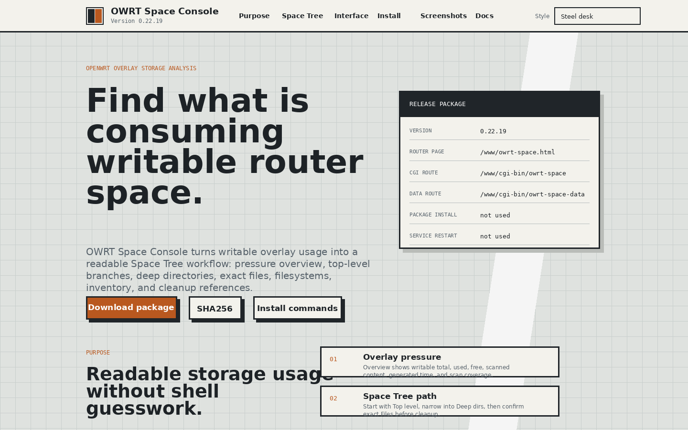
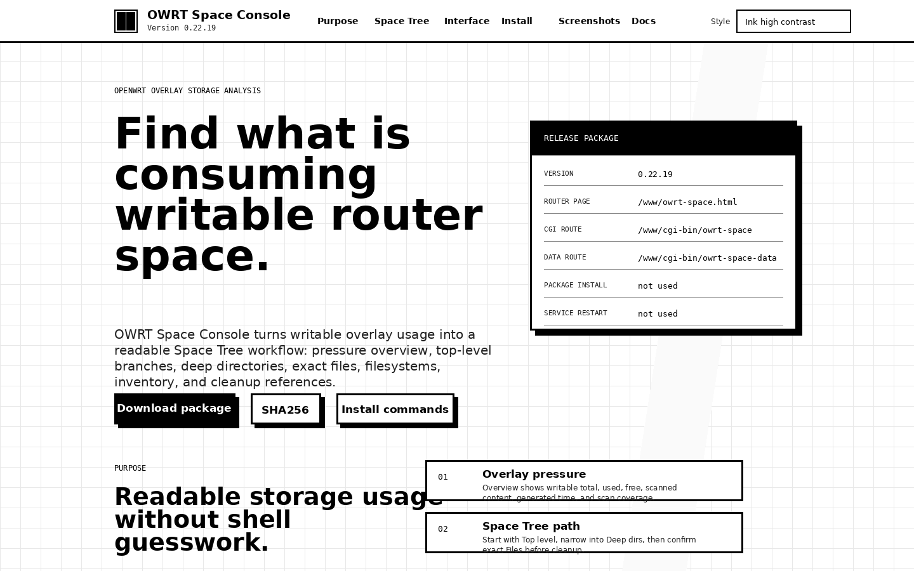
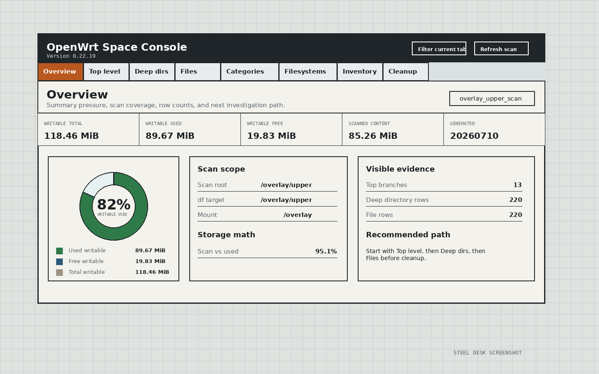
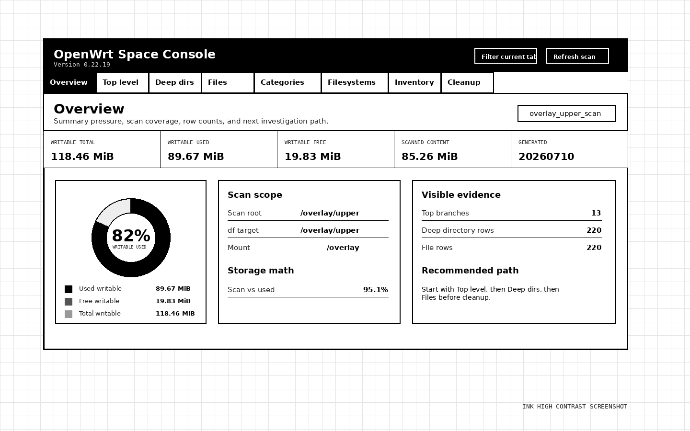
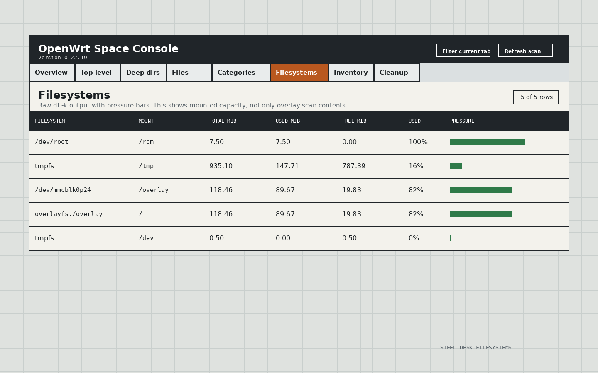
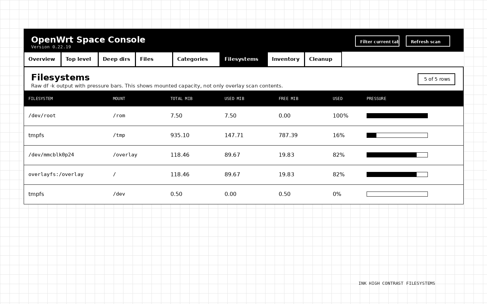

# OWRT Space Console 0.22.19

OWRT Space Console is an OpenWrt writable overlay storage inspection interface with a tabbed Space Tree workflow.

## Release

| Field | Value |
| --- | --- |
| Version | `0.22.19` |
| License | Apache-2.0 |
| Router page | `/www/owrt-space.html` |
| CGI route | `/www/cgi-bin/owrt-space` |
| Data route | `/www/cgi-bin/owrt-space-data` |

## Screenshots

These screenshots are embedded in the README with image markup. They are generated from this package. The Ink high contrast images use separate Ink high contrast files. The Steel desk images use separate Steel desk files.

### GitHub Pages, Steel desk



### GitHub Pages, Ink high contrast



### Router app, Steel desk Overview



### Router app, Ink high contrast Overview



### Router app, Steel desk Filesystems



### Router app, Ink high contrast Filesystems



## Screenshot verification

`docs/SCREENSHOT_SHA256SUMS.txt` lists each screenshot hash. `docs/SCREENSHOT_PAIR_AUDIT.txt` records that the Steel desk and Ink high contrast screenshot pairs are not the same image.

## Install

```sh
sh install_owrt_space_console_0_22_19_FULL_REPLACE_APP.sh
```

Open after install:

```text
https://openwrt-ip-address/owrt-space.html
```

Live refresh route:

```text
https://openwrt-ip-address/cgi-bin/owrt-space?refresh=1
```

## GitHub Pages themes

The GitHub Pages index exposes only two themes:

- Steel desk
- Ink high contrast

## License

Apache-2.0. See `LICENSE`.
